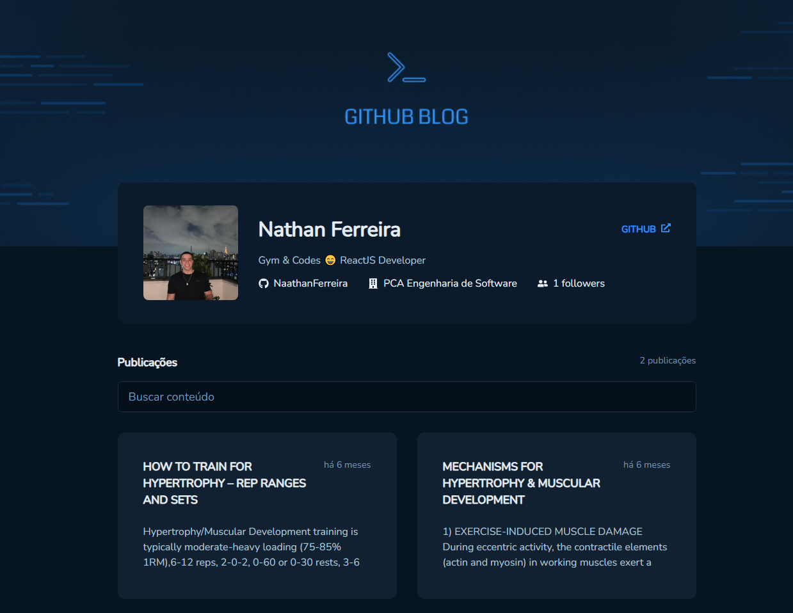
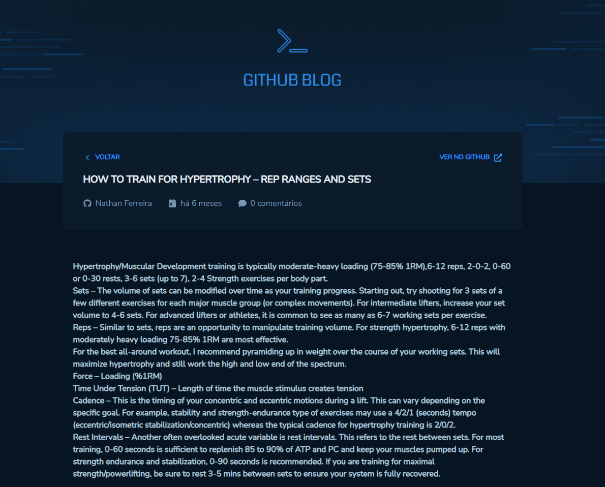

<h1 style="text-align: center; font-weight: bold;">Github Blog</h1>

## Demo 📸

<div align="center" >
  
  
</div>

---
## About the project

A simple blog, where the issues of this repository are the posts of the blog.

### 🛠 Technologies

- [React](https://react.dev/)
- [ChakraUI](https://chakra-ui.com/)
- [ReactRouterDom](https://reactrouter.com/en/main)
- [ReactHookForm](https://react-hook-form.com/)
- [TypeScript](https://www.typescriptlang.org/)
- [Axios](https://axios-http.com/ptbr/docs/intro)
- [DateFns](https://date-fns.org/)
- [ReactMarkdown](https://github.com/remarkjs/react-markdown)
---

### 🎲 Run

```bash
# Clone this repository
$ git clone https://github.com/NaathanFerreira/github-blog.git
# Access the project folder on terminal/cmd
$ cd github-blog
# Install dependencies
$ yarn
# or
$ npm install
# Start the application
$ yarn start
# or
$ npm start
```